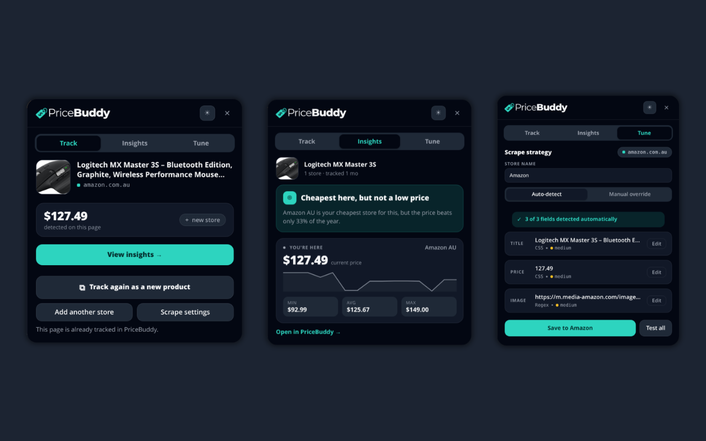

# PriceBuddy Browser Extensions

Browser extensions that act as companion clients for a self-hosted
[PriceBuddy](https://github.com/jez500/pricebuddy) instance.

> **You need your own PriceBuddy server.** This is a client — it holds no data
> and does nothing on its own. Everything lives on the instance you point it at.

| Browser | Directory | Status |
| ------- | --------- | ------ |
| Chrome / Chromium / Edge | [`chrome/`](chrome/) | Prototype — works, not yet published |
| Firefox | — | Not started |

## What it does

Click the toolbar icon on any product page to open an in-page panel, with a
☀/☾ light/dark toggle that defaults to your OS preference.



📹 **[Watch it in action](https://www.youtube.com/watch?v=Iv_NELXQ1AE)** (39s, no sound) — tracking a product from an
Amazon page through to it appearing in PriceBuddy. Also in the repo as
[`assets/extension-in-action.webm`](assets/extension-in-action.webm).

### Track

The landing tab for a page that isn't tracked yet. Shows the product title,
image and domain, the **price detected on this page**, and how many PriceBuddy
stores already match the domain. **Track this product**
(`POST /api/products` with `create_store: true`) starts monitoring it and jumps
you to Insights.

### Insights

For an already-tracked product (`GET /api/products/{id}?include=insights`):

- a **verdict card** — *"Good time to buy here"*, *"Cheaper at &lt;store&gt;"* with
  the saving and a one-click button, or *"Cheapest here, but not a low price"*
  when the deal score disagrees with being the cheapest store;
- a **"You're here" card** — the current store's price, its own history
  sparkline, and that store's min / avg / max;
- **other stores'** prices with a trend glyph and a **BEST** badge;
- **all-store min / avg / max**, and a link into PriceBuddy.

Which listing is "here" is decided by the server (`current_url` → `is_current`),
not by matching URLs in the browser.

### Tune

The scrape-strategy workbench.

**Store name** and **Fetched with** apply to the whole store, not one product.
*Fetched with* picks the scraper: **HTTP** is a plain fetch and is faster;
**Browser** drives a real browser and is the one that works on pages that render
their price with JavaScript.

> If every field comes back empty on a site you can see a price on, switch
> *Fetched with* to **Browser** and press *Test all*. An empty result looks like
> a bad selector but is usually the wrong fetch method.

Then, in either mode:

- **Auto-detect** — asks PriceBuddy to detect a strategy for the page and lists
  what each field (*title* / *price* / *image*) resolved to, with a confidence
  hint. **✦ Try AI detection** appears here when a field is missing: it asks your
  instance to work the selectors out with its configured AI provider. Slower,
  best-effort, and it tells you when it gave up rather than failing silently.
- **Manual override** — per field, choose a strategy type (Schema.org / CSS /
  XPath / Regex / JSON path) and a value. **◎ Pick on page** lets you click the
  element and generates a resilient selector (preferring
  `itemprop`/`data-testid`/stable classes, with `nth-of-type` fallback and
  attribute extraction `|src` / `|content` / `|value`).

**Test all** scrapes the live page with your *draft* strategy — including the
draft fetch method — and shows matched / no-match per field, so you can verify a
change before committing it. **Save to store** creates the store, or updates the
existing one.

Drafts are saved per-domain as you type, so work survives a reload.

## Install (developer / unpacked)

1. Open `chrome://extensions`.
2. Enable **Developer mode** (top right).
3. **Load unpacked** → select `chrome/`.

## Configure

1. Right-click the toolbar icon → **Options** (or open the panel and press
   **Open settings**).
2. **API URL** — the base URL of your instance, e.g.
   `https://price-buddy.example.com`, with no trailing `/api`.
3. **API token** — create one in PriceBuddy under **API keys**
   (`/admin/api-keys`):
   - store helper + extraction only: `user:detail`,
     `meta-extraction:extract`, `client-config:read`;
   - **Track this product** and price history additionally need product access —
     use an **all access** (`*`) token. The panel surfaces a clear message when
     the token is too narrow (HTTP 403).
4. Press **Save**. Chrome asks for permission to reach that address — the
   extension requests no site access until you grant it.
5. **Test connection** verifies via `GET /api/user`.

## Usage

**Track a product** — open the panel on a product page; it lands on Track (or
Insights if already tracked) and shows the detected price. Press **Track this
product**.

**Tune a store** — switch to **Tune**. If Auto-detect found all three fields,
press **Save to store**. Otherwise use **Manual override**: **◎ Pick on page**
or type a selector, **Test all** to check it against the live page, then save.

## Permissions

The extension ships with **no host access at all**.

- `activeTab` — temporary access to the current tab, granted by clicking the
  toolbar icon. That's when the panel is injected, so there is no content script
  running on every page you visit.
- `scripting` — injects the panel into that tab.
- `storage` — settings, theme, and per-site drafts.
- `optional_host_permissions: <all_urls>` — never requested wholesale. The
  options page requests **only your PriceBuddy origin**, once, when you save it.

`tabs` is deliberately not requested: `chrome.tabs.sendMessage` needs host
access, not that permission.

## Security notes

- **The API token never leaves the service worker.** Every authenticated request
  is made in `src/background.js`; the panel is told only the base URL and whether
  the extension is configured. The panel is injected into arbitrary sites, so
  keeping the credential out of that context matters.
- **No remote resources.** No CDN scripts, styles or fonts — the UI uses the
  system font stack. CI fails the build if one appears.
- **All rendering goes through `textContent`**, never `innerHTML` with data, so
  nothing your instance returns can execute in a page. Also CI-enforced.
- **URLs are scheme-checked** before becoming a link or reaching `window.open`.

See [`PRIVACY.md`](PRIVACY.md) for what is stored and what is sent where.

## Repository layout

```
chrome/            The Chrome (MV3) extension
  manifest.json
  src/
    background.js    Service worker: API proxy, permissions, panel toggle
    lib/api.js       PriceBuddyClient — thin HTTP API wrapper
    content/         In-page panel (shadow DOM) + pure view-models
    options/         Settings page
  images/          PriceBuddy wordmark (from the app repo)
  test/            node --test unit tests for the view-models
assets/            Store screenshot + screencast (not shipped in the extension)
CLAUDE.md          Working notes for AI coding agents
PRIVACY.md         Privacy policy
PUBLISHING.md      Chrome Web Store submission + GitHub Actions release guide
TODO.md            Prioritised backlog
```

## Development

No build step, no bundler, no dependencies.

```bash
cd chrome && npm test     # node --test over test/
```

`npm test` covers `src/content/viewmodels.js` only — the pure transforms. Changes
to `panel.js`, `background.js` or `options.js` are **not** covered; load the
unpacked extension and exercise them.

CI additionally validates the manifest against the store's limits, checks every
file the manifest references exists, and fails on remote resources, unexpected
permissions, or unsafe `innerHTML`.

## Design

The palette mirrors the PriceBuddy Filament panel — primary `Color::Teal`,
Tailwind gray neutrals, `gray-950` page / `gray-900` cards in dark mode — so the
extension reads as part of the same product. Tokens live in `THEMES` in
`src/content/viewmodels.js`; the options page mirrors them in `options.css`.
Never hardcode a colour in the panel CSS.

## Licence

MIT — see [LICENSE](LICENSE). The bundled wordmark is from the PriceBuddy project.
